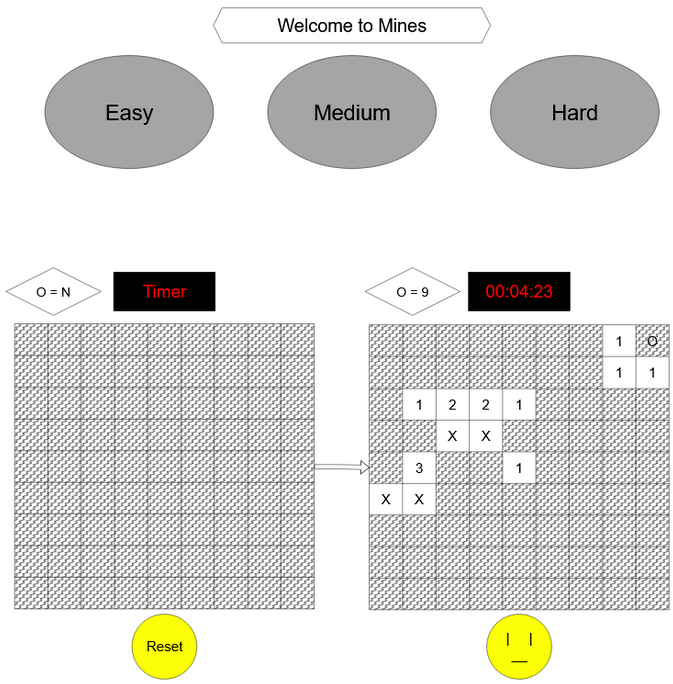

# MineHunter (Minesweeper Clone)
Minesweeper is a logic puzzle video game genre generally played on personal computers. The game features a grid of clickable tiles, with hidden mines dispersed throughout the board. The objective is to clear the board without detonating any mines, with help from clues about the number of neighboring mines in each field. 

## Game Overview
- The game welcomes the player with a title screen and game name.
- Players can enter a custom `gridSize` and `numberOfMines`.
- If no input is given, the default grid is 12x12 with 10 mines.

## Grid
- The grid consists of clickable tiles.
- Clicking a tile reveals:
  - A number indicating nearby mines, or
  - An empty space that reveals adjacent safe tiles.
  
## Mines
- Mines are randomly hidden within the grid.
- Clicking on a mine results in an immediate game over.
- Clearing all non-mine tiles results in a win.

## Flags
- Players can flag hidden tiles they suspect contain a mine.
- The number of flags available matches the number of mines.
- Flag count is always visible to the player.

## Timer
- A timer starts on the first click and counts up.
- It displays the total time taken when the game ends.

## Game Status
- The game displays a message upon win or loss.
- Mines are revealed if the player loses.

## Themes
- The game supports light and dark theme selection.
- The selected theme is saved in local storage and restored on reload.

## How to Run
[MineHunter](minehunter.surge.sh)

Open the `index.html` file in any modern web browser. No installation or setup required.

# WireFrame

## Game Logic (Pseudocode)
* HTML setup
    * metadata
    * h2 tag for title
    * input for grid size
    * input for number of mines
    * button for setting input
    * div for grid
    * div for flag amount
    * div for timer
    * select and options for themes
* CSS
    * Styling
    * Styling different data-statuses for tile object

* Javascript setup

DOM

* Assign HTML elements to variables:
* Grid container
* Flag counter
* Theme selector
* Timer
* Input fields for grid and mine count
* Set grid button
* Retrieve saved theme from local storage (if exists)

Define tileStatus object with states: 

* `hidden` 
* `mine` 
* `number` 
* `marked`

Variables

* `gridSize`
* `numberOfMines`
* `timer`
* `timeInterval`

### Grid Parameters

setGrid():
* Read and parse user input for grid size and number of mines
* If input invalid or too many mines:
      Use default values (gridSize=12, numberOfMines=10)
* Clear input fields

### Create Grid

createGrid(gridSize, numberOfMines):
* Generate mine positions using getMinePositions()
* For each tile:
* Create HTML div element
* Store tile's coordinates and whether it contains a mine
* Define get/set methods for tile status
* Return 2D array of tiles (grid)

### Generate Random Mines

getMinePositions(gridSize, numberOfMines):
* Initialize empty location array
* While total mines < desired number:
* Generate random row/col coordinates
* If coordinates not already in the array, add them
* Return list of mine coordinates

### Utility Functions
random(size):
* Return a random number from 0 to size-1

mineMatch(x, y):
* Return true if x and y have same row and column

stopProp(event):
* Prevent further event propagation (disable clicking tiles)

### Flagging
flagged(tile):
* If tile is not hidden or marked, do nothing
* Toggle between hidden and marked status
* Add/remove flag emoji accordingly

flagCount():
* Count how many tiles are marked
* Update flagsLeft display (mines - flagged)

### Revealing

reveal(grid, tile):
* If tile is not hidden, do nothing
* If tile is a mine:
    * Set status to mine and show bomb emoji
* Else:
    * Set status to number
    * Get surrounding tiles
    * Count surrounding mines
* If no mines, recursively revealsurrounding tiles
* Else, display the number of nearby mines

surroundingTiles(grid, tile):
* Get all 8 neighboring tiles of the current tile
* Return valid surrounding tiles
    
### Win and Lose Conditions
checkWin(grid):
* Return true if all non-mine tiles are revealed

checkLose(grid):
* Return true if any tile has status "mine"

gameStatus():

* Check for win or lose
* If either is true:
    * Stop timer
    * Disable further clicks
* If win:
    * Display win message and time
* If lose:
    * Show all mines
    * Remove any incorrect flags
    * Display lose message
### Render Grid
Create grid using createGrid()
For each tile:
* Append to grid element in DOM
* On left-click: reveal and check game status
* On right-click: toggle flag and update flag count

Set CSS grid size

Initialize flag counter on screen

### Theme Selection
If theme is saved in local storage:
* Set current theme from saved value
Else:
* Use selected theme from dropdown

Add event listener to theme selector:
* Update document theme and save selection in localStorage

### Timer
startTimer():
* If already running, do nothing
* Else, start counting every 1 second and display it

stopTimer():
* Clear the interval to stop the timer

*Thanks for checking out this project!*

